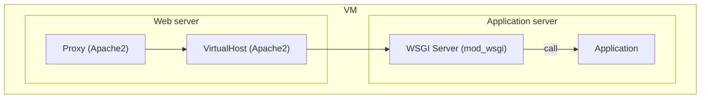
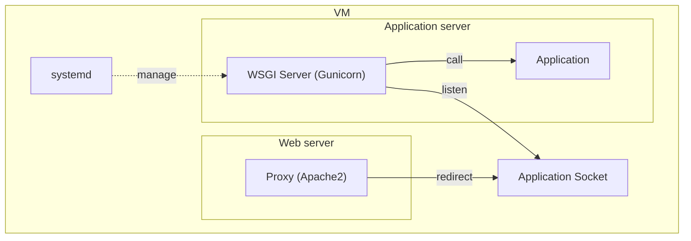
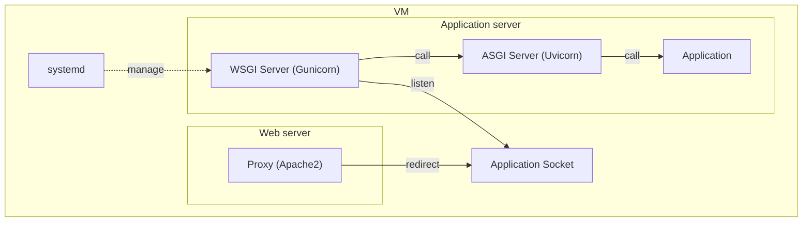
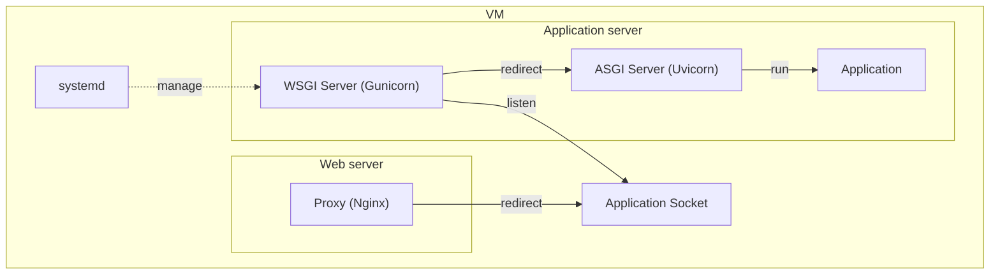

# Benchmark Py-API

In this project you'll find several production like implementation of a simple Veterinary service.

The project aim to bench several proxy, web-server, application configuration in python.

# Running a Benchmark 
## Setting Up VM
After running the following command, you'll have Virtual machine up for the benchmark.
The initial VM has 2 CPU cores and 2048 MB of memory
``` 
poetry env use </path-to-your-python-exe>
poetry install
poetry shell

vagrant up --provision
```
The virtual Machine has a user Bench that you will use to install the applications.
Here is how the file system works:

```bash
/ #root
├─ opt/
│  ├─ src/ # Applications source code
│  ├─ venv/ # Application's python virtualenv
├─ /
├─ run/ # Application sockets
├─ etc/ 
│  ├─ apache2/ # Application Apache2 configuration files
│  ├─ nginx/   # Application Nginx configuration files
│  ├─ systemd/ # Application Service files
```

Now that everything is ready, we'll install the services for the different configuration we want to test.


## Setting up applications

> When needed make sure the required modules are installed for `apache2` :
> - mod_proxy: `sudo a2enmod proxy`

### flask-example
#### `Apache` + `mod_wsgi` 

First you need to make sure that `mod_wsgi` is installed for the python version of the application (`3.10`).

`sudo apt-get install libapache2-mod-wsgi-py3`

Then we'll create a virtual host for the application...
```xml
<VirtualHost *:80>

    ServerName mod_wsgi.app

    DocumentRoot /usr/local/www/documents

    <Directory /usr/local/www/documents>

    WSGIScriptAlias /myapp /usr/local/www/wsgi-scripts/myapp.wsgi

</VirtualHost>
```
...and configure the proxy in order to expose the service outside the VM.
```xml
    ProxyPass / https://private_host.com:7443/
    ProxyPassReverse / https://private_host.com:7443/
```


You'll notice in the chart below that the server does not need a service manager like `systemd`
`apache2` and `mod_wsgi` manage the WSGI server.



> Commands:
> | action | cmd |
> |--------|-----|
> |        |     |

#### `Apache` + `gunicorn`
For this example, setting up the application will be easier since the WSGI configuration can remains the same for this example and `nginx + gunicorn` example. That's because application is completely decoupled from proxy.



> Commands:
> | action | cmd |
> |--------|-----|
> |        |     |

#### `Nginx` + `gunicorn`
 


> Commands:
> | action | cmd |
> |--------|-----|
> |        |     |

### fastapi-example
#### `Apache`  + `gunicorn` + `uvicorn`
Lorem ipsum dolor sit amet, consectetur adipiscing elit.



> Commands:
> | action | cmd |
> |--------|-----|
> |        |     |

#### `Nginx`  + `gunicorn` + `uvicorn`
Lorem ipsum dolor sit amet, consectetur adipiscing elit.




> Commands:
> | action | cmd |
> |--------|-----|
> |        |     |
