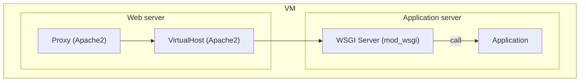
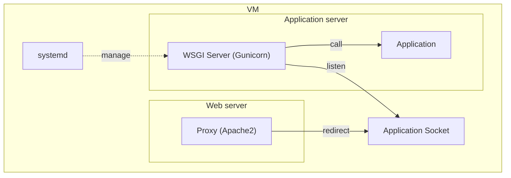
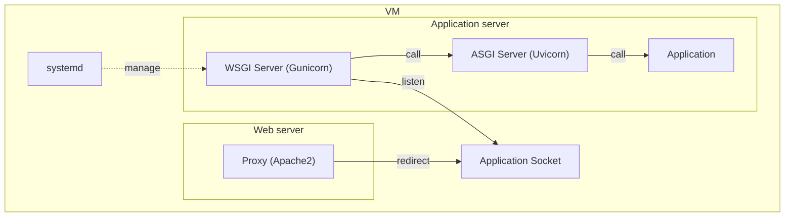
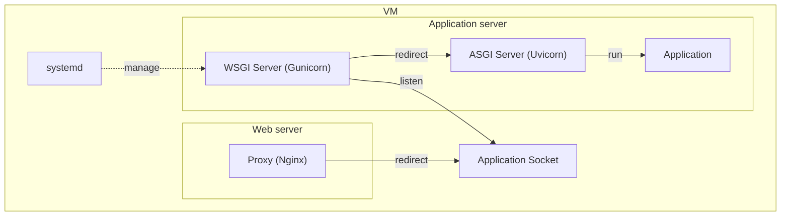

# Benchmark Py-API

In this project you'll find several production like implementation of a simple Veterinary service.

The project aim to bench several proxy, web-server, application configuration in python.

# Running a Benchmark 

> **Requirements**
> - [Vagrant](https://www.vagrantup.com/) (With vagrant scp `vagrant plugin install vagrant-scp`)
> - [Poetry](https://python-poetry.org/) (with [multi-project plugin](https://pypi.org/project/poetry-multiproject-plugin/))
> - [VirtualBox](https://www.virtualbox.org/)

## Setting Up VM
After running the following command, you'll have Virtual machine up for the benchmark.
The initial VM has 2 CPU cores and 2048 MB of memory
``` 
poetry env use </path-to-your-python-exe>
poetry install
poetry shell

vagrant up --provision
```
The virtual Machine has a user Bench that you will use to install the applications.
Here is how the file system will be used:

```bash
/ #root
├─ home/
│  ├─ bench/ # we will put application wheel here
├─ opt/
│  ├─ src/ # Applications source code & conf file (.wsgi files)
│  ├─ venv/ # Application's python virtualenv
├─ etc/ 
│  ├─ apache2/ # Apache2 configuration files
│  ├─ nginx/   # Nginx configuration files
│  ├─ systemd/ # Service files
├─ run/ # Application sockets
├─ var/ # Application storage (sqlite)
```

Now that everything is ready, we'll install the services for the different configuration we want to test.


## Setting up applications

> When needed make sure the required modules are installed for `apache2` :
> - mod_proxy: `sudo a2enmod proxy`

To start with the installation you'll want to build the archive or `wheel` for the application to test with `poetry build-project` command.

```bash
cd flask-example && poetry build-project
cd ..
cd fastapi-example && poetry build-project
```

Now we will send the packaged app in our virtual machine and install it.

```bash
vagrant scp flask-example/dist/flask_example-0.1.0-py3-none-any.whl .
vagrant scp fastapi-example/dist/fastapi_example-0.1.0-py3-none-any.whl .

vagrant ssh
sudo mv *.whl /home/bench
```

Now we've got the minimal files to create all our needed configuration.

For each of the below configurations we will create a python virtualenv and the required configuration files.

```bash
vagrant ssh
su -l bench # password: bench
python --version # Make sure you are using python 3.10.4

python -m venv /opt/venv/<my-experiment-name>
source /opt/venv/<my-experiment-name>/bin/activate
pip install /home/bench/<flask-or-fastapi-deps>
pip install <additional-deps> # gunicorn, uvicorn, etc.
```

### flask-example
#### flask-mod-wsgi (`Apache` + `mod_wsgi`)

First you need to make sure that `mod_wsgi` is installed for the python version of the application (`3.10`).

```sh
sudo apt-get install apache2-dev

source /opt/venv/flask-mod-wsgi/bin/activate
pip install /home/bench/flask_example-0.1.0-py3-none-any.whl
pip install mod_wsgi # activate your python 3.10

sudo /opt/venv/flask-mod-wsgi/bin/mod_wsgi-express install-module | sudo tee /etc/apache2/mods-available/wsgi.load

sudo a2enmod wsgi
sudo service apache2 restart
```

Then we'll create a virtual host for the application...
```xml
<VirtualHost *:80>

    ServerName mod_wsgi.app

    DocumentRoot /usr/local/www/documents

    <Directory /usr/local/www/documents>

    WSGIScriptAlias /myapp /usr/local/www/wsgi-scripts/myapp.wsgi

</VirtualHost>
```
...and configure the proxy in order to expose the service outside the VM.
```xml
    ProxyPass / https://private_host.com:7443/
    ProxyPassReverse / https://private_host.com:7443/
```


You'll notice in the chart below that the server does not need a service manager like `systemd`.
`apache2` and `mod_wsgi` manage the WSGI server.



#### flask-a2 (`Apache` + `gunicorn`)
For this example, setting up the application will be easier since the WSGI configuration can remains the same for this example and `nginx + gunicorn` example. That's because application is completely decoupled from proxy.

```bash
source /opt/venv/flask-a2/bin/activate
pip install /home/bench/flask_example-0.1.0-py3-none-any.whl
pip install gunicorn
```



#### flask-nginx (`Nginx` + `gunicorn`)

```bash
source /opt/venv/flask-nginx/bin/activate
pip install /home/bench/flask_example-0.1.0-py3-none-any.whl
pip install gunicorn
```


### fastapi-example
#### fastapi-a2 (`Apache`  + `gunicorn` + `uvicorn`)
```bash
source /opt/venv/fastapi-a2/bin/activate
pip install /home/bench/fastapi_example-0.1.0-py3-none-any.whl
pip install gunicorn
```



#### fastapi-nginx (`Nginx`  + `gunicorn` + `uvicorn`)
```bash
source /opt/venv/fastapi-nginx/bin/activate
pip install /home/bench/fastapi_example-0.1.0-py3-none-any.whl
pip install gunicorn
```


